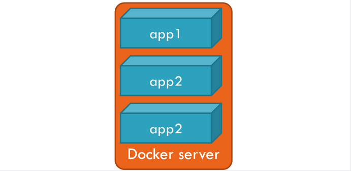
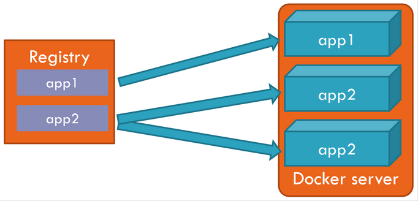

```bash
$ docker run hello-world
```

## Containers
A container is what we eventually want to run and host in Docker. You can think of it as an isolated machine, or a virtual machine if you prefer.

From a conceptual point of view, a container runs inside the Docker host isolated from the other containers and even the host OS. It cannot see the other containers, physical storage, or get incoming connections unless you explicitly state that it can. It contains everything it needs to run: OS, packages, runtimes, files, environment variables, standard input, and output.



## Images
Any container that runs is created from an _image_. An image describes everything that is needed to create a container; it is a template for containers. You may create as many containers as needed from a single image.




## Registries

Images are stored in a _registry_. In the example above, the _app2_ image is used to create two containers. Each container lives its own life, and they both share a common root: their image from the registry.

## Common Docker Commands

- _docker ps_: lists the containers that are still running. Add the **-a** switch in order to see containers that have stopped
- _docker logs_: retrieves the logs of a container, even when it has stopped
- _docker inspect_: gets detailed information about a running or stopped container
- _docker stop_: stops a container that is still running
- _docker rm_: deletes a container

```bash
docker ps 
# Lists the running containers

docker ps -a
# Lists containers that have stopped

docker log <container-id>
# Allows to have to have a look at containers output

docker inspect <container-id>
# Get a lot of info about the container

docker rm <container-id>
# Removes the container

docker container prune -f
# removes all containers -f is for confirmation
```

### More docker run

```bash
docker run alpine printenv
# apline is the image from which we want to build our container
# and printenv is the command we want to execute
```


