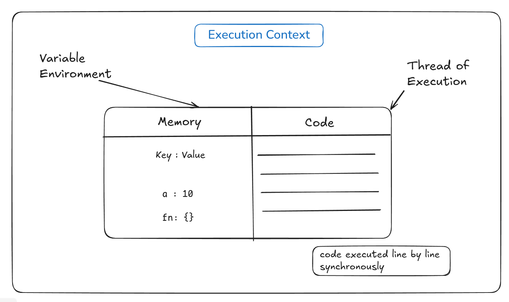
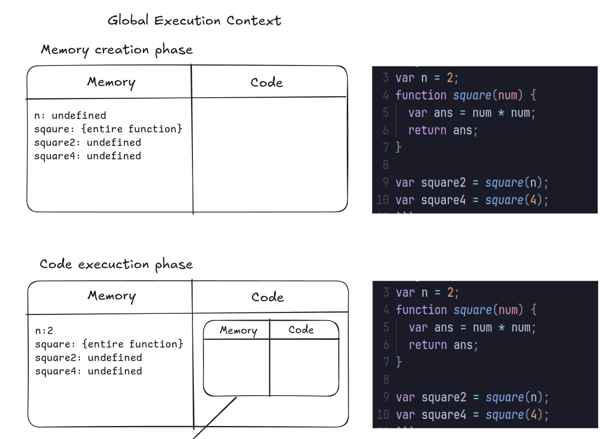
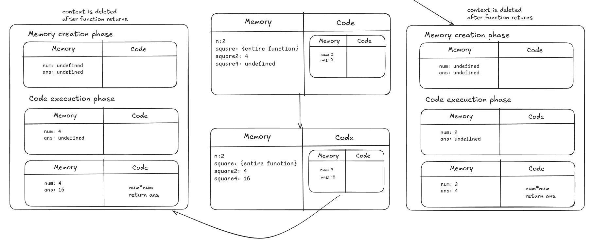

# JS Code Execution

## Execution Context

- Everything in JS happens inside **Exectition Context**
- Execution context is the environment where the code is executed.

> [!IMPORTANT]
> Javascript is a **synchornous** single threaded language



### Example

```js
var n = 2;
function square(num) {
  var ans = num * num;
  return ans;
}

var square2 = square(n);
var square4 = square(4);
```

### Creation of execution context

1. When the code is executed, the first execution context is created which is called **Global Execution Context**
2. When a function is called, a **new execution context** is created for that function.
3. Execution context consists of Variable Environment and Thread of Execution.
4. **Variable Environment** consists of all the variables declared in the function.
5. **Thread of Execution** is the actual code that is executed(line by line).
6. Creation of Execution context is done in two phases:
   - **Creation Phase**
   - **Execution Phase**



#### Execution context for a function execution
