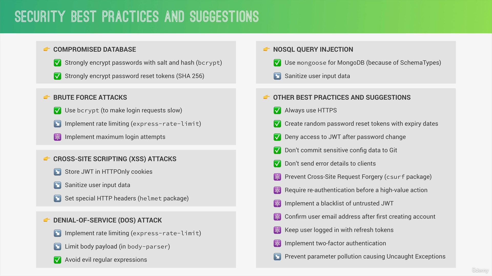

## Security


### Rate Limiting

```js
const rateLimit = require('express-rate-limit')

const limiter = rateLimit({
	max:100, // MAX number of requests per window
	windowMs: 60*60*1000, // size if window in Ms
	message: "You many requests from this IP,please try again in a hour"
	// Error message
})

app.use(limiter)
// or
app.use('/api',limiter)
```
### Limit body payload

```js
const express = require('express')

app.use(express.json({
	limit:10kb
}))
```
### Cross Site Scripting (XSS)

```js
const xss = require('xss-clean')

app.use(xss())

```

### Secure HTTP Headers

```js
const helmet = require('helmet')

// SETS secure HTTP headers
app.use(helmet())
```

### NoSQL Injection

```js
const mongoSanitize = require('express-mongo-sanitize')

app.use(mongoSanitize())
```

### Parameter Pollution

```js
const hpp = require('hpp')

app.use(hpp({
	whitelist: ['duration','price'],
}))
```