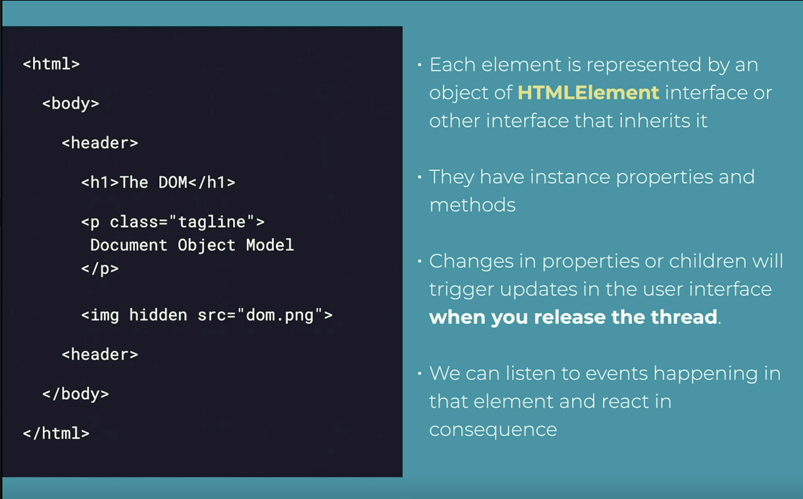

# Vanilla JS

> Creating web apps without any libraries or framework
> Using core languages and browser APIs

## Advantages

- Lightweight
- Control and Power
- Simplicity
- Flexibilty
- Performance
- Compatibilty
- No node_modules

## Fears

- Routing for SPA's
- State Management
- Templating
- Reusable components
- Scalability

> [!IMPORTANT]
> Learn the tool and use it when it's the best option

## DOM

> Document Object Model
> structure of web page in memory

- **DOM API** : browser API exposed to devs to manipulate DOM

- Available on

1. `window` global object
2. `document` object
3. One Object per HTML element and other nodes in document



> release thread when code execution finishes (Ex. eventListener callback
> returned)

To work with DOM elements

1. Pick them from DOM
2. Create them,and then inject them in DOM

#### Selecting elements from the DOM

- `getElementById`
- `getElementByClassName`
- `querySelector`
- All these return one HTMLElement

> [!IMPORTANT]
> All the above functions can return null

- `querySelectorAll` : static collection(NodeList) has length,forEach
- `getElementsByTagName`
- `getElementsByClassName`
- `getElementsByName`

- You dont get null you get []

- Donts have map,reduce,filter
  **Solution** : use `Array.from(collection)`

## Events

### Normal

```js
// NOTE: can add multiple event listeners to same element
element.addEventListener("load", (e) => {});
element.addEventListener("load", () => {});
```

### Advanced

```js
// execute only once
const options = {
  once: true,
  passive: true,
};

element.addEventListener("load", () => {}, options);
element.removeEventListener("load", () => {});
```

#### Dispatching custom event

```js
const event = new CustomEvent("myEvent", {
  detail: { key: "value" },
});

element.dispatchEvent(event);
```
